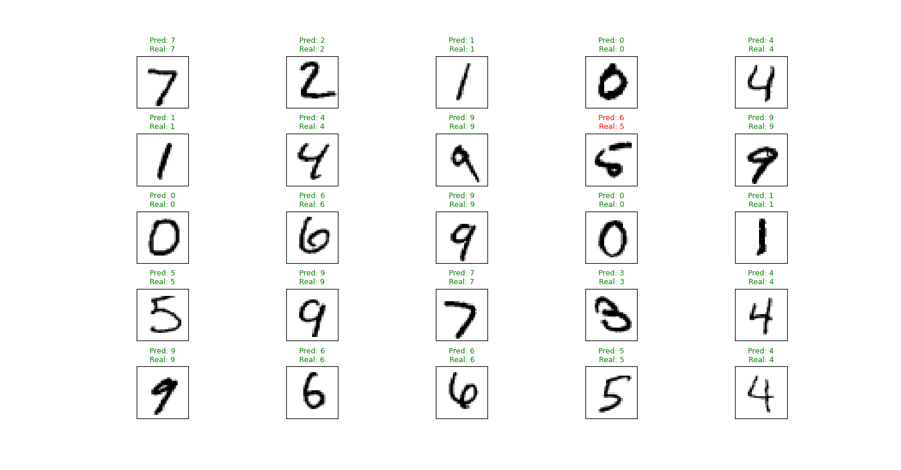

# Simple numpy neural network
---
#### Disclaimer
This project was developed as a learning and research exercise to understand better how neural networks work. Feel free to use the code as you wish.

## Summary

A simple implementation of different parts of a feed-forward neural network using numpy, including:

- Layers
- Activation functions
- Loss functions
- Forward pass
- Backpropagation
- Optimizers

No machine learning frameworks such as PyTorch are used.

## Implemented Features

- Layers
  - [x] Dense layers
  - [x] Dropout
- Activation functions
  - [x] ReLU activation
  - [x] Sigmoid activation
  - [x] Tanh
  - [x] Softmax activation
- Loss functions
  - [x] MSE
  - [x] BCE
  - [x] Cross-entropy loss
- Optimizers
  - [x] Gradient descent optimizer
  - [ ] Adam optimizer
- Others
  - [x] MNIST example
  - [ ] Benchmark + test units

## Result
The following model has been tested in the MNIST dataset using mini-batch training reaching an acurracy >= 99%.

```python
model_clas = Model()
model_clas.addLayer(Linear(784, 1024))
model_clas.addLayer(ReLU())
model_clas.addLayer(Linear(1024, 512))
model_clas.addLayer(ReLU())    
model_clas.addLayer(Linear(512, 10))
model_clas.addLayer(Softmax())
```

```
Test acc: 99.35%
```




## Example of use
See `example-classification.py`, `example-regression.py` and `example-dropout.py` for more examples of use.
